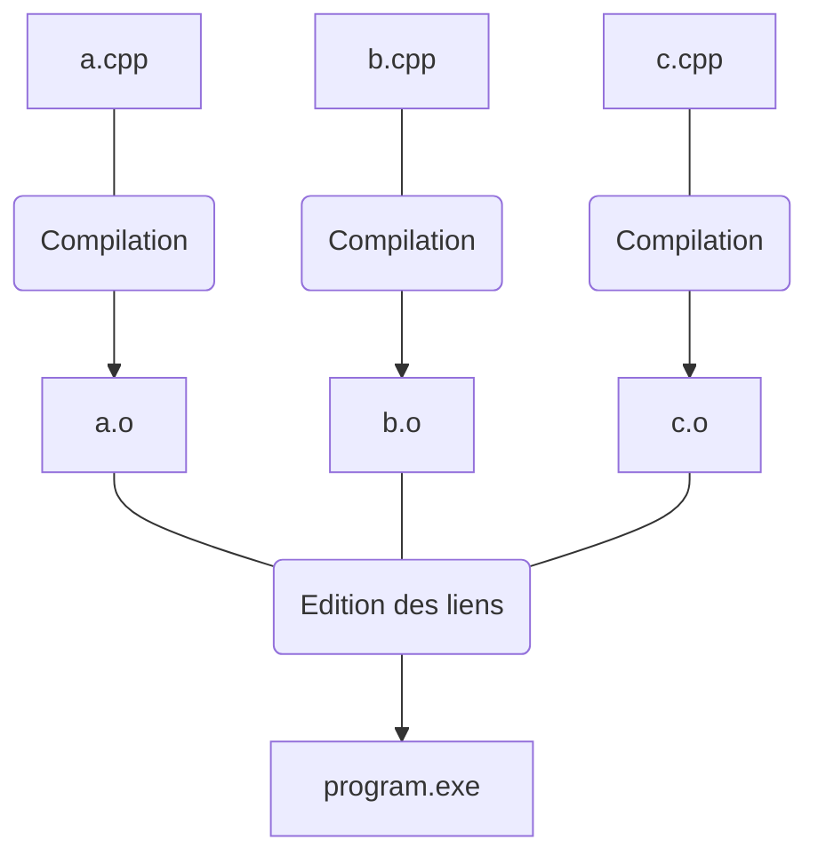
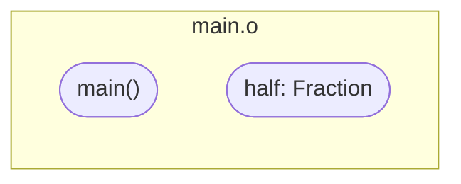
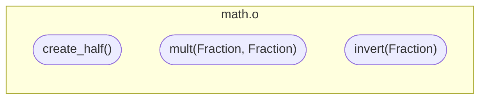
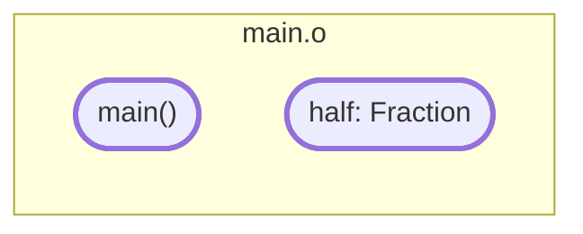
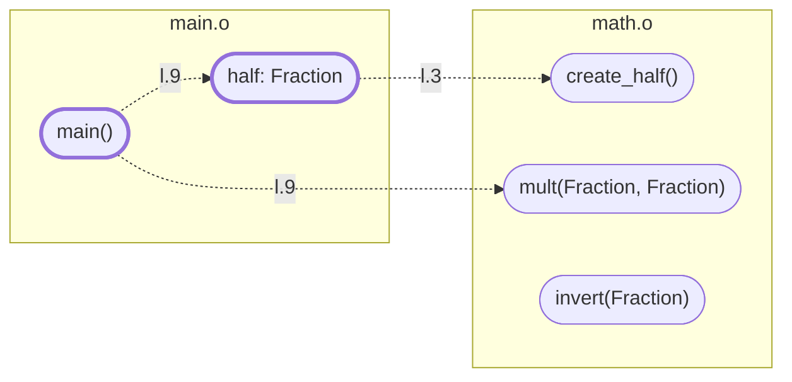
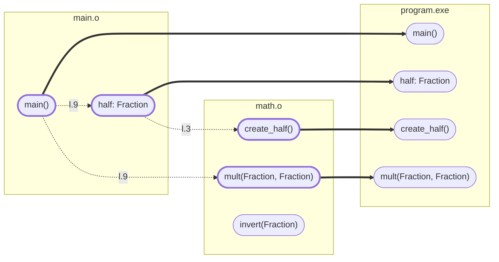

En théorie, le contenu de cette page ne devrait être qu'une redite de vos cours de C et de compilation de l'an dernier.  
Cependant, je sais qu'à la réminiscence des moments passés à réviser ces matières, la plupart d'entre vous sentez la chaleur de vos larmes couler le long de vos joues.

Nous allons donc reprendre le sujet en douceur pour faire en sorte que vous compreniez un peu mieux ce qu'il se passe pendant la compilation et à quoi elle sert.  
Cela vous aidera, j'espère, à comprendre un peu mieux les injures du compilateur.

---

### Compilation d'un programme

La compilation désigne le procédé consistant à transformer du code-source en un code-objet (c'est-à-dire des instructions machines) comme un fichier-objet, un programme ou une librairie.  
Dans ce cours, on utilisera le terme de "compilation" pour faire référence soit à la génération complète d'un exécutable (= compilation d'un programme), soit à la génération d'un fichier-objet (= compilation d'un fichier-source).

La **compilation d'un programme** est constituée de deux phases bien distinctes :
1. La **compilation de chacun de vos `.cpp`** en fichier-objet, réalisée par le compilateur,
2. L'**édition des liens**, qui permet de créer un exécutable à partir de tous vos fichiers-objet, réalisée par le linker.

`g++` est à la fois un compilateur et un linker.  
Lorsque vous exécutez `g++ -o program.exe a.cpp b.cpp c.cpp`, l'outil réalise donc 4 opérations :
1. La compilation de `a.cpp` ➔ `g++ -c a.cpp`
2. La compilation de `b.cpp` ➔ `g++ -c b.cpp`
3. La compilation de `c.cpp` ➔ `g++ -c c.cpp`
4. L'édition des liens pour générer `program.exe` ➔ `g++ -o program.exe a.o b.o c.o`



---

### Compilation

Concentrons nous d'abord sur la phase de compilation.

Le compilateur attend en entrée un fichier `.cpp` et écrit le fichier-objet correspondant.
Ce fichier est un binaire contenant les instructions des fonctions et l'instanciation des variables globales définies dedans.

Lorsque vous lancez la compilation, il y a tout d'abord le préprocesseur qui lit et récrit le fichier.
Il remplace notamment chaque instruction `#include` par le contenu du fichier inclus et toutes les occurrences de macros préprocesseur (`#define`) par leur définition.

Ensuite, nous avons l'analyse syntaxique et l'analyse sémantique.  
Plutôt qu'expliquer précisément ce que fait le compilateur pour chacune d'entre elles, nous allons décrire ce qu'il se passe de façon plus globale et, j'espère, plus intuitive.

Le compilateur lit le fichier instruction par instruction, en partant du haut du fichier.  
Si l'instruction contient :
- une définition ou déclaration de symboles (variable, fonction ou type).  
➔ Le compilateur ajoute ce symbole à la table des symboles.
- l'utilisation d'un symbole, comme un appel de fonction, la lecture ou l'écriture d'une variable.  
➔ Le compilateur regarde dans la table des symboles **s'il existe** et **si le contexte d'utilisation est cohérent**.
- la fin d'un bloc.  
➔ le compilateur supprime de la table des symboles tous ceux qui ont été définis dans ce bloc.

Au fur-et-à-mesure de l'analyse, le compilateur ajoute également dans le fichier-objet les instructions binaires correspondant aux fonctions et aux variables globales définies dans le fichier.

Supposons que l'on a le code suivant dans `math.hpp` :
```cpp {linenos=table}
struct Fraction
{
    int num;
    int den;
};

Fraction add(Fraction f1, Fraction f2);
```
Et ce code dans `main.cpp` :
```cpp {linenos=table}
#include "math.hpp"

Fraction half { 1, 2 };

int main()
{
    Fraction third { 1, 3 };

    Fraction res = add(half, third);
    return res.num;
}
```

Tout d'abord, le préprocesseur copie-colle le contenu de `math.hpp` à la place de la directive d'inclusion.
On obtient donc :
```cpp {linenos=table}
struct Fraction
{
    int num;
    int den;
};

Fraction add(Fraction f1, Fraction f2);

Fraction half { 1, 2 };

int main()
{
    Fraction third { 1, 3 };

    Fraction res = add(half, third);
    return res.num;
}
```

Puis le compilateur lit les instructions au fur-et-à-mesure :
- ligne 1  
    📚 Ajout dans la table des symboles  
    - `Fraction`: type partiellement défini  
- ligne 3  
    📚 Ajout dans la table des symboles
    - `Fraction`: type partiellement défini  
    - `Fraction.num`: variable `int`  
- ligne 4  
    📚 Ajout dans la table des symboles
    - `Fraction`: type partiellement défini  
    - `Fraction.num`: variable `int`  
    - `Fraction.den`: variable `int`  
- ligne 4  
    📚 Modification de la table des symboles
    - `Fraction`: type défini avec deux attributs `int`  
    - `Fraction.num`: variable `int`  
    - `Fraction.den`: variable `int`  
- ligne 7  
    🧐 Utilisation de `Fraction` dans le cadre d'une déclaration de fonction  
    - `Fraction` est au moins partiellement défini dans la table des symboles  
    - `Fraction` est bien utilisé en tant que type

    📚 Ajout dans la table des symboles  
    - `Fraction`: type défini avec deux attributs `int`  
    - `Fraction.num`: variable `int`  
    - `Fraction.den`: variable `int`  
    - `add`: fonction `(Fraction, Fraction) -> Fraction`
- ligne 9  
    🧐 Utilisation de `Fraction` dans le cadre d'une définition de variable globale  
    - `Fraction` est entièrement défini dans la table des symboles  
    - `Fraction` est bien utilisé en tant que type  
    - l'instance est bien construite avec deux `int`  

    📚 Ajout dans la table des symboles  
    - `Fraction`: type défini avec deux attributs `int`  
    - `Fraction.num`: variable `int`  
    - `Fraction.den`: variable `int`  
    - `add`: fonction `(Fraction, Fraction) -> Fraction`
    - `half`: variable `Fraction`

    ⚙️ Ecriture du fichier-objet  
    - Variable globale `half` de valeur `{ 1, 2 }`
- ligne 13  
    🧐 Utilisation de `Fraction` dans le cadre d'une définition de variable  
    - `Fraction` est entièrement défini dans la table des symboles  
    - `Fraction` est bien utilisé en tant que type  
    - l'instance est bien construite avec deux `int`  

    📚 Ajout dans la table des symboles  
    - `Fraction`: type défini avec deux attributs `int`  
    - `Fraction.num`: variable `int`  
    - `Fraction.den`: variable `int`  
    - `add`: fonction `(Fraction, Fraction) -> Fraction`
    - `half`: variable `Fraction`
    - `third`: variable `Fraction`
- ligne 13  
    🧐 Utilisation de `Fraction` dans le cadre d'une définition de variable  
    - `Fraction` est entièrement défini dans la table des symboles  
    - `Fraction` est bien utilisé en tant que type  
    - l'instance est bien construite avec deux `int`  

    📚 Ajout dans la table des symboles  
    - `Fraction`: type défini avec deux attributs `int`  
    - `Fraction.num`: variable `int`  
    - `Fraction.den`: variable `int`  
    - `add`: fonction `(Fraction, Fraction) -> Fraction`
    - `half`: variable `Fraction`
    - `third`: variable `Fraction`
- ligne 15  
    🧐 Utilisation de `add` dans le cadre d'un appel de fonction pour définir une variable
    - `add` est bien une fonction déclarée dans la table des symboles  
    - le type de retour est bien compatible avec le type de la variable

    🧐 Utilisation de `half` et `third` en tant qu'arguments de type `int`  
    - `half` et `third` sont bien des variables déclarées dans la table des symboles
    - elles sont de type `int` donc peuvent bien être passées à la fonction

    📚 Ajout dans la table des symboles  
    - `Fraction`: type défini avec deux attributs `int`  
    - `Fraction.num`: variable `int`  
    - `Fraction.den`: variable `int`  
    - `add`: fonction `(Fraction, Fraction) -> Fraction`
    - `half`: variable `Fraction`
    - `third`: variable `Fraction`
    - `res`: variable `Fraction`

- ligne 16  
    🧐 Utilisation de `res.num` dans le cadre d'un retour de fonction
    - `res` est bien une variable déclarée dans la table des symboles
    - `res` est de type `Fraction`, qui est bien entièrement défini dans la table des symboles
    - `Fraction` contient bien un attribut `num`
    - le type de retour de la fonction et le type de `res.num` sont bien compatibles

- ligne 17  
    📚 Suppression des symboles définis dans le bloc  
    - `Fraction`: type défini avec deux attributs `int`  
    - `Fraction.num`: variable `int`  
    - `Fraction.den`: variable `int`  
    - `add`: fonction `(Fraction, Fraction) -> Fraction`
    - `half`: variable `Fraction`
    - ~~`third`: variable `Fraction`~~
    - ~~`res`: variable `Fraction`~~

    ⚙️ Ecriture du fichier-objet  
    - Variable globale `half` de valeur `{ 1, 2 }`
    - Fonction `main()`

Dans le cas ci-dessus, la compilation s'est bien passée.  
Le fichier-objet en sortie contient :
- une variable globale appelée `half` et les instructions binaires permettant de l'initialiser à `{ 1, 2 }`,
- une fonction `main` qui n'attend aucun paramètres et les instructions binaires qui la constituent.

---

### Mais c'est quoi cette erreur ?? 🤯

Il nous apparaît utile de faire un petit tour des situations d'erreurs les plus courantes, afin que vous puissiez identifier les problèmes plus rapidement si vous les rencontrez.  

Et vous les rencontrerez forcément, eheheh... 😈

Commencez par vous placer dans le répertoire `chap-01/3-build-errors`, car c'est là que vous devrez compiler les différents fichiers.

#### 1. expected ';' after class definition

1. Essayez de compiler le fichier `1-structs.cpp` (et seulement de le compiler, pas de générer un exécutable).
Celui-ci ne devrait pas compiler.

{}
On doit ajouter l'option `-c` pour s'arrêter après la phase de compilation. 
```b
g++ -std=c++17 -c 1-structs.cpp
```
{}

2. Le compilateur devrait afficher l'erreur suivante deux fois : `expected ';' after struct definition`.  
Qu'est-ce que cela signifie ? Que devez-vous faire pour que le fichier compile ?  
Effectuez ces modifications et vérifiez que le fichier compile désormais.

{}
Contrairement au Java, il faut penser à écrire `;` après la définition de tout type (`class`, `struct`, `enum`, etc).
```cpp  {hl_lines=[4,9]}
struct A
{
    int a = 0;
};

struct B
{
    int b = 0;
};

int add(A a, B b)
{
    return a.a + b.b;
}
```
{}

#### 2. 'bla' is private within this context 

1. Essayez maintenant de compiler le fichier `2-class.cpp`.  
Que signifie l'erreur de compilation ? Pourquoi ne l'avez vous pas rencontrée dans le fichier `1-structs.cpp` ?

{}
L'erreur signifie qu'on essaye d'accéder à un champ privé d'une classe depuis l'extérieur.  
Lorsqu'on ne spécifie pas de modificateur de visibilité, les champs sont privés dans une `class` et publics dans une `struct`.
C'est pour ça que nous n'avons pas eu l'erreur dans le fichier précédent. 
{}

2. Modifiez le fichier pour corriger l'erreur et recompilez.

{}
```cpp {hl_lines=3}
class A
{
public:
    int a = 0;
};

int get_a(A a)
{
    return a.a;
}
```
{}

#### 3. 'bla' is not a member of 'std'

1. Essayez de compiler le fichier `3-hello.cpp`.  
Quelles sont les différentes erreurs obtenues ? Expliquez la cause de chacune d'entre elles.

{}
Le compilateur n'a jamais rencontré les déclarations des symboles `std::cout`, `std::cin`, `std::endl` et `std::string`.
Lorsqu'il analyse les instructions qui les utilisent, il ne les trouve donc pas dans la table des symboles et émet donc des erreurs du style `'...' is not a member of 'std'`.

On a également l'erreur `'name' was not declared in this scope`.
Celle-ci est plus étonnante, puisque `name` est bien définie une ligne plus haut.  
Cependant, comme l'instruction définissant la variable `name` n'a pas compilé, elle n'a pas pu être ajoutée à la table des symboles.
Le compilateur ne la trouve donc pas au moment où il analyse l'instruction `std::cin >> name;`, ce qui explique cette erreur.
{}

2. Ajoutez ce qu'il faut au fichier pour corriger les erreurs et recompilez.

{}
```cpp {hl_lines=[1,2]}
#include <iostream> // pour std::cin, std::cout et std::endl
#include <string>   // pour std::string

int main()
{
    std::string name;
    std::cin >> name;

    std::cout << "Hello " << name << std::endl;

    return 0;
}
```
{}

{}
Une erreur de compilation est parfois la conséquence d'une autre erreur, ce qui peut rendre la sortie du compilateur très difficile à lire.  
Il est possible de spécifier l'option `-Wfatal-errors` à l'invocation du compilateur pour s'arrêter dès la première erreur et simplifier la compréhension du problème.
{}

#### 4. redefinition of 'bla'

1. Lancez la compilation de `4-main.cpp`.  
Quelle est l'erreur ? Essayez de l'expliquer en imaginant le contenu du fichier après le passage du préprocesseur.

{}
Après le passage du préprocesseur, le fichier devrait ressembler à :
```cpp
// =========================================//
// Inclusion de 4-car.hpp depuis 4-main.cpp //
// =========================================//
                                            //
    /** le contenu de <string> **/          //
                                            //
    struct Car                              //
    {                                       //
        std::string brand;                  //
    };                                      //
                                            //
// =========================================//

// ================================================//
// Inclusion de 4-driver.hpp depuis 4-main.cpp     //
// ================================================//
                                                   //
    // =========================================// //
    // Inclusion de 4-car.hpp depuis 4-main.cpp // //
    // =========================================// //
                                                // //
        /** le contenu de <string> **/          // //
                                                // //
        struct Car                              // //
        {                                       // //
            std::string brand;                  // //
        };                                      // //
                                                // //
    // =========================================// //
                                                   //
    /** le contenu de <iostream> **/               //
                                                   //
    struct Driver                                  //
    {                                              //
        void drive(Car car)                        //
        {                                          //
            std::cout << "I'm driving a "          //
                      << car.brand                 //
                      << std::endl;                //
        }                                          //
    };                                             //
                                                   //
// ================================================//

int main()
{
    Car car { "golf" };

    Driver driver;
    driver.drive(car);

    return 0;
}
```

Lorsque le compilateur parcourt le fichier, il rencontre deux fois la définition du type `Car`.  
Il est donc logique qu'il émette l'erreur `redefinition of 'Car'`.
{}

2. En C++, pour empêcher les inclusions multiples d'un même header, il suffit d'écrire `#pragma once` en haut du fichier.  
Corrigez le code et assurez-vous que le fichier `4-main.cpp` compile désormais. 

{}
On modifie d'abord `4-car.hpp`, puisque c'est ce fichier qui est inclus en double.

```cpp {hl_lines=1}
#pragma once

#include <string>

struct Car
{
    std::string brand;
};
```

Une fois ce changement fait, on constate que le code compile.  
Pour éviter que le problème ne se reproduise si on décidait d'inclure `4-driver.hpp` dans un autre header, on modifie également ce dernier.

```cpp {hl_lines=1}
#pragma once

#include "4-car.hpp"

#include <iostream>

struct Driver
{
    void drive(Car car)
    {
        std::cout << "I'm driving a " << car.brand << std::endl; 
    }
};
```
{}

{}
Prenez l'habitude de toujours placer la directive `#pragma once` au sommet de vos headers.
Cela vous évitera quelques migraines.
{}

#### 5. 'bla' has not been declared

La plupart du temps, l'erreur ci-dessus apparaît lorsque vous oubliez d'inclure un header.  
Cependant, elle peut également se produire dans la situation présentée ci-dessous, et est dans ce cas beaucoup plus difficile à identifier et corriger.

1. Compilez le fichier `5-main.cpp` avec l'option permettant de s'arrêter dès la première erreur.

{}
```b
g++ -std=c++17 -Wfatal-errors -c 5-main.cpp 
```
{}

2. Vous devriez obtenir l'erreur : `5-tac.hpp:8:15: error: 'Tic' has not been declared`.  
Pourtant, le header `5-tic.hpp` est bien inclus dans `5-tac.hpp`.  
Pourquoi le compilateur n'arrive pas à reconnaître le symbole `Tic` ?  

{}
Dans un premier temps, il faut savoir ce que le compilateur analyse une fois la précompilation terminée : 
```cpp
// =====================================================//
// Inclusion de 5-tic.hpp depuis 4-main.cpp             //
// =====================================================//
                                                        //
    #pragma once // -> 1e inclusion de 5-tic.hpp        //
                                                        //
    // ==============================================// //
    // Inclusion de 5-tac.hpp depuis 5-tic.cpp ======// //
    // ==============================================// //
                                                     // //
        #pragma once // -> 1e inclusion de 5-tac.hpp // //
                                                     // //
        // =====================//                   // //
        // #include "5-tic.hpp" // -> déjà inclus !  // //
        // ---------------------//                   // //
                                                     // //
        struct Tac                                   // //
        {                                            // //
            // Invert value with tic.                // //
            void swap(Tic& tic);                     // //
                                                     // //
            int value = 0;                           // //
        };                                           // //
                                                     // //
    // ==============================================// //
                                                        //
    struct Tic                                          //
    {                                                   //
        // Invert value with tac.                       //
        void swap(Tac& tac);                            //
                                                        //
        int value = 0;                                  //
    };                                                  //
                                                        //
// =====================================================//

int main()
{
    Tic tic { 1 };
    Tac tac { 5 };

    tic.swap(tac);
    tac.swap(tic);

    return 0;
}
```

Effectivement, lorsque le compilateur arrive à l'instruction `void swap(Tic& tic);`, la définition de `Tic` n'a encore jamais été rencontrée.  
Le symbole n'existant pas encore dans la table des symboles, on obtient l'erreur `'Tic' has not been declared`.
{}

2. Quel est le nom donné à ce type de situation ?

{}
Il s'agit d'une **inclusion cyclique**.  
Effectivement `5-tic.hpp` inclut `5-tac.hpp` qui inclut à son tour `5-tic.hpp` et ainsi de suite.
{}

Pour indiquer au compilateur qu'un type existe, on a deux possibilités : le définir ou le **pré-déclarer** (on employera plus communément le terme anglais **forward-declare**).  
Il suffit pour cela d'écrire :
```cpp
class A;    // forward-declare d'une class A
struct B;   // forward-declare d'une struct B
enum C;     // forward-declare d'un enum C
```

3. Supprimez les directives d'inclusions problématiques, et ajoutez des forward-declarations à la place.  
Vérifiez que cela fixe bien le problème.

{}
Les directives d'inclusions problématiques sont celles situées dans les fichiers `5-tic.hpp` et `5-tac.hpp`.  
On remplace donc le code de `5-tic.hpp` par :
```cpp {hl_lines=3}
#pragma once

struct Tac;

struct Tic
{
    // Invert value with tac.
    void swap(Tac& tac);

    int value = 0;
};
```

Et celui de `5-tac.hpp` par :
```cpp {hl_lines=3}
#pragma once

struct Tic;

struct Tac
{
    // Invert value with tic.
    void swap(Tic& tic);

    int value = 0;
};
```
{}

{}
Certaines directives d'inclusion peuvent être remplacées par des forward-declarations, mais pas toutes !  
En effet, ici, cela fonctionne parce que dans le fichier `5-tac.hpp`, on ne fait que déclarer une référence de type `Tic`.  
Si on avait voulu accéder à l'un des champs de la classe, ou bien à sa taille pour réserver de l'espace mémoire, la définition complète de `Tic`, et donc l'inclusion du header, aurait été nécessaire.  
{}

---

### Edition des liens

Je vous conseille d'abord de faire une pause, si vous venez de finir de lire tout ce qu'il y avait au-dessus.  
Idéalement, attendez même d'avoir passé une bonne nuit de sommeil avant de reprendre la lecture 😴 

Une fois le fonctionnement du compilateur bien assimilé, il est temps de passer à celui du linker.  
Dans le cadre de la génération d'un programme, l'objectif du linker est de regrouper, depuis les fichiers-objet fournis, les instructions strictement nécessaires à son exécution.

Supposons que l'on essaye de linker deux fichiers objets `main.o` et `math.o` avec la commande : `g++ -o program.exe main.o math.o`.  
On suppose que `main.o` est le résultat de la compilation de :
```cpp {linenos=table}
#include "math.hpp"

Fraction half = create_half();

int main()
{
    Fraction third { 1, 3 };

    Fraction res = mult(half, third);
    return res.num;
}
```
que `math.o` est le résultat de :
```cpp {linenos=table}
#include "math.hpp"

Fraction create_half()
{
    Fraction f;
    f.num = 1;
    f.den = 2;
    return f;
}

Fraction mult(Fraction f1, Fraction f2)
{
    Fraction res;
    res.num = f1.num * f2.num;
    res.den = f1.den * f2.den;
    return res;
}

Fraction invert(Fraction f)
{
    Fraction res;
    res.num = f.den;
    res.den = f.num;
    return res;
}
```

et que `math.hpp` contient le code suivant :
```cpp {linenos=table}
#pragma once

struct Fraction
{
    int num;
    int den;
};

Fraction create_half();
Fraction mult(Fraction f1, Fraction f2);
Fraction invert(Fraction f);
```

Dans ce cas, `main.o` contient les instructions de la fonction `main()` et les instructions d'initialisation de la variable globale `half`, tandis que `math.o` contient les instructions des fonctions `create_half()`, `mult(Fraction, Fraction)` et `invert(Fraction)`.

<style>
    pre.mermaid {
        display: inline-block;
        margin-top: 0;
        margin-bottom: 0;
    }
</style>





Le linker identifie les éléments dont les instructions seront exécutées quoi qu'il arrive :
- Le point d'entrée du programme, c'est-à-dire la fonction `main`,
- Les instructions nécessaires à l'initialisation des variables globales.




Il analyse ensuite les instructions associées à chaque élément de manière à créer les liens vers les bonnes fonctions.



Cela lui permet d'identifier l'ensemble des éléments à placer dans l'exécutable final.



L'exécutable final ne contient donc que les symboles effectivement utilisés par le programme.  
La fonction `invert(Fraction)` présente dans `math.o` et qui n'est jamais appelée n'en fait donc pas partie.

---

### Encore plus d'erreurs ! 😭

De la même façon que nous l'avons fait avec les erreurs de compilation, nous allons vous présenter quelques situations d'erreurs émises au cours de l'édition des liens.

Commencez par vous placer dans le répertoire `chap-01/4-link-errors`.

#### 1. undefined reference to `main'

1. Compilez le fichier `1-hello_wordl.cpp` pour en faire un fichier-objet, puis essayez de créer un programme à partir de ce fichier-objet.  
Quel est le message d'erreur ? Pouvez-vous identifier dans la sortie complète le nom du programme effectuant l'édition des liens ? 

{}
Pour récupérer une erreur humainement lisible, il faut faire un peu de ménage dans la sortie.

```b
g++ -std=c++17 -c 1-hello_wordl.cpp
# => Ok
g++ -o program 1-hello_wordl.o
# => [plein de trucs horribles à lire] undefined reference to `main' (ou WinMain sous Windows)
```

On note également le message `ld returned 1 exit status` à la toute fin.  
Le programme chargé de l'édition des liens est donc `ld`.
{}

2. Corrigez le programme afin que le linker puisse trouver son point d'entrée.

{}
Il y a une typo dans le nom de la fonction `main`, ce qui empêche le linker de la trouver.
```cpp {hl_lines=3}
#include <iostream>

int main()
{
    std::cout << "Hello world!" << std::endl;
    return 0;
}
```
{}

{}
Lorsque la sortie d'erreurs se termine par quelque chose comme `ld returned 1 exit status`, cela indique que l'erreur se produit durant l'édition des liens.
{}

#### 2. undefined reference to `bla(...)' #1

1. Que fait la commande `g++ -std=c++17 -o program 2-main.cpp` ?

{}
La commande réalise d'abord la compilation de `2-main.cpp` en fichier-objet, puis invoque le linker pour générer un exécutable à partir de ce fichier.
{}

2. Exécutez-la.  
Quelle est la sortie du programme ? La compilation du fichier `2-main.cpp` en fichier-objet s'est-elle bien passée ?  

{}
On obtient quelque chose comme :
```b
2-main.cpp: undefined reference to `add(int, int)'
error: ld returned 1 exit status
```

La compilation du fichier `2-main.cpp` s'est donc bien passée, puisque c'est la phase d'édition des liens (`ld`) qui échoue.
{}

3. Quels sont les symboles présents dans le ou les fichiers-objet passés à l'édition des liens ?

{}
Après la précompilation, le fichier `2-main.cpp` est transformé en :
```cpp {linenos=table}
#pragma once

int add(int a, int b);

int main()
{
    return add(1, 2);
}
```

A la suite de la compilation de ce fichier, `2-main.o` contient uniquement les instructions de la fonction `main`.  
En effet, la ligne 3 est une déclaration de fonction.
Le compilateur ne connaissant pas la définition de `add(int, int)`, il ne peut pas générer les instructions binaires qui lui seraient associées.
{}

4. Que manque-t-il dans la ligne de commande pour que le programme compile ?

{}
La définition de la fonction `add(int, int)` est présente dans le fichier `2-add.cpp`.  
Il suffit donc d'ajouter ce fichier à la ligne de commande :
```b
g++ -std=c++17 -o program 2-main.cpp 2-add.cpp
```
{}

#### 3. undefined reference to `bla(...)' #2

1. Exécutez maintenant `g++ -std=c++17 -o program 3-main.cpp 3-sub.cpp`.  
Quelle est l'erreur ? Que contient le fichier-objet `3-sub.o` ?  

{}
L'erreur est la suivante, et il s'agit à nouveau d'une erreur de link.
```b
3-main.cpp: undefined reference to `sub(int, int)'
```

Après précompilation, le fichier `3-sub.cpp` contient :
```cpp
#pragma once

int sub(int a, int b);

float sub(float a, float b)
{
    return a - b;
}
```

Le fichier `3-sub.o` contient donc les instructions binaires de la fonction `sub(float, float)`, et non pas celles de `sub(int, int)`.
{}

2. Pourquoi la phase de compilation des fichiers `3-main.cpp` et `3-sub.cpp` ne produit pas d'erreur ?

{}
Le fichier `3-main.o` précompilé devrait avoir ce contenu :
```cpp
#pragma once

int sub(int a, int b);

int main()
{
    return sub(1, 2);
}
```

Il n'y a donc aucune raison qu'il ne compile pas, puisque la fonction `sub(int, int)` est correctement déclarée avant son appel, et que les arguments fournis ont un type compatible avec la signature de la fonction.

En ce qui concerne le fichier `3-sub.cpp`, nous avons :
```cpp
#pragma once

int sub(int a, int b);

float sub(float a, float b)
{
    return a - b;
}
```

Ici, on pourrait se demander pourquoi le compilateur accepte d'avoir une déclaration de `sub` qui attend des `int`, et une définition de `sub` qui attend des `float`.  
C'est tout simplement parce qu'en C++, la **surcharge** de fonctions est autorisée (comme en Java).

On pourrait par exemple avoir dans un autre fichier-source, ou bien dans le même que celui-ci, une définition valide de `sub(int, int)`, en plus de la définition déjà existante de `sub(float, float)`.  
En fonction du type des arguments passés à l'appel, le compilateur choisirait la fonction avec la signature la plus proche.
{}

3. Comment pourriez-vous modifier le programme pour que celui-ci compile ?

{}
Il y a plusieurs solutions possibles.
1. Modifier la signature de `sub` dans `3-sub.cpp` pour qu'elle accepte des `int` plutôt que des `float`.  
Ainsi, le linker pourra trouver le symbole `sub(int, int)` dans `3-sub.o`.
2. Modifier la déclaration de `sub` dans `3-sub.hpp` pour indiquer qu'elle attend des `float`.  
De cette manière, à la compilation de `3-main.cpp`, le symbole associé à `sub` dans la table des symboles aura pour signature `sub(float, float)` au lieu de `sub(int, int)`,
3. Ajouter la déclaration de `sub(float, float)` dans `3-sub.hpp` et la définition de `sub(int, int)` dans `3-sub.cpp`, pour que les deux versions existent pendant la phase de link.

L'essentiel, c'est de faire en sorte que les déclarations présentes dans le header correspondent bien aux définitions présentes dans le fichier-source.
{}

{}
Si vous rencontrez une erreur de type `undefined reference to ...`, commencez par vérifier que vous n'avez pas oublié de compiler un fichier-source.  
Si le problème ne vient pas de là, assurez-vous que la **signature** de votre fonction (nom + type des paramètres) est bien strictement la même dans sa définition et dans ses déclarations. 
{}

#### 4. multiple definition of `bla'

1. Exécutez la commande `g++ -std=c++17 -o prog 4-main.cpp 4-sub.cpp 4-add.cpp`.  
Quelle est l'erreur ?

{}
En supprimant tous les caractères bizarres de la sortie, on obtient ces erreurs :
```b
4-add.cpp: multiple definition of `debug(char const*, int, int)'
4-sub.cpp: first defined here
```
{}

2. Quels sont les symboles présents dans les fichiers-objet `4-add.o` et `4-sub.o` ?

{}
Après la précompilation de `4-add.cpp`, on a :
```cpp
#pragma once

int add(int a, int b);

//-----------------------------

#pragma once

// le contenu de <iostream>

void debug(const char* fcn, int p1, int p2)
{
    std::cout << fcn << " called with " << p1 << " and " << p2 << std::endl;
}

//-----------------------------

int add(int a, int b)
{
    debug("add", a, b);
    return a + b;
}
```

Les symboles présents dans `4-add.o` sont donc :
- `debug(const char*, int, int)`
- `add(int, int)`

Similairement, après la précompilation de `4-sub.cpp`, on a :
```cpp
#pragma once

int sub(int a, int b);

//-----------------------------

#pragma once

// le contenu de <iostream>

void debug(const char* fcn, int p1, int p2)
{
    std::cout << fcn << " called with " << p1 << " and " << p2 << std::endl;
}

//-----------------------------

int sub(int a, int b)
{
    debug("sub", a, b);
    return a - b;
}
```

Les symboles présents dans `4-sub.o` sont donc :
- `debug(const char*, int, int)`
- `sub(int, int)`

Le symbole `debug(const char*, int, int)` est bien présent deux fois, d'où l'erreur du linker.
{}

3. Proposez une solution qui pourrait régler le problème, mais ne l'appliquez pas tout de suite.

{}
On pourrait créer un fichier `4-debug.cpp` dans lequel on déplacerait la définition de `debug(const char*, int, int)`.
Dans le fichier `4-debug.hpp`, on aurait uniquement la déclaration de la fonction.  
Ainsi le symbole ne serait plus présent dans `4-add.o` ni `4-sub.o`, seulement dans `4-debug.o`.
{}

Pour contraindre le linker à accepter qu'un symbole soit présent dans plusieurs fichiers-objet, vous pouvez placer le mot-clef `inline` devant sa définition dans le code-source.  
Dans ce cas, au moment d'écrire le symbole dans l'exécutable final, le linker utilisera la version trouvée dans n'importe lequel des fichiers-objet.

Cela vous permet donc de définir vos fonctions directement dans les headers.
S'ils sont inclus depuis plusieurs fichiers-source, le linker fera comme si les fonctions n'étaient présentes que dans l'un d'entre eux et n'émettera pas d'erreurs.

4. Essayez de corriger le programme utilisant le mot-clef `inline`.

{}
On remplace le contenu de `4-debug.hpp` par :
```cpp {hl_lines=5}
#pragma once

#include <iostream>

inline void debug(const char* fcn, int p1, int p2)
{
    std::cout << fcn << " called with " << p1 << " and " << p2 << std::endl;
}
```
{}

{}
Dans le cadre de petits programmes, il n'y a aucune contre-indication à utiliser `inline` pour coder un maximum de choses dans les headers.  
En revanche, pour de plus gros programmes, sachez que plus vous mettrez de choses dans les headers, plus la compilation prendra du temps.
{}

---

### Synthèse

Il faut retenir que la compilation d'un programme se fait en deux étapes : la compilation des fichiers-source suivie de l'édition des liens.

Durant la compilation, le compilateur :
- ajoute les symboles dans une table lorsqu'il voit leurs définitions ou leurs déclarations,
- ajoute les instructions binaires des fonctions au fichier-objet losqu'il parcourt leur définition,
- vérifie que les symboles sont utilisés dans le bon contexte, à l'aide du contenu de la table des symboles.

Durant l'édition des liens, le linker :
- retrouve pour chaque appel de fonction sa définition dans les fichiers-objet,
- écrit l'exécutable final en commençant par les instructions de la fonction `main`, et en ajoutant récursivement les instructions des fonctions appelées dedans. 

Quelques bonnes pratiques lorsqu'on code **le contenu d'un header** :
- On commence toujours par écrire `#pragma once`,
- On utilise des "forward-declare" plutôt que des inclusions lorsque cela est possible,
- On écrit `inline` devant les **définitions** de fonctions (pas les déclarations).
