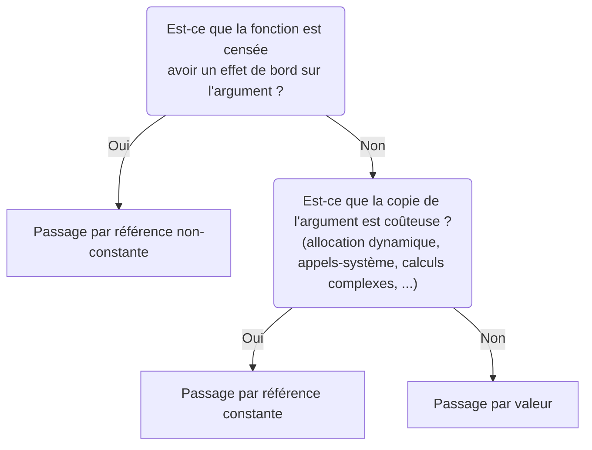

Comme cela doit paraître encore un peu abstrait, nous allons vous présenter concrètement les principaux cas d'utilisation des références. Notez qu'il en existe un autre, mais vous le découvrirez dans le chapitre sur l'héritage !

---

### Modifier un argument

Le premier cas d'utilisation des références avait déjà été décrit dans le chapitre 1 : il s'agit de pouvoir **modifier la valeur ou le contenu d'un argument** passé à une fonction.

Pour rappel, lorsque vous passez un objet par valeur en paramètre à une fonction, l'intégralité de l'instance est copiée !  
Pour les personnes habituées au Java, le transcription de langage consisterait à **cloner** explicitement l'objet avant l'appel.
```cpp
void fcn(MyClass obj)
{
    ...
}

int main()
{
    auto obj = MyClass { ... };
    fcn(obj);

    return 0;
}
```
serait équivalente à :
```java {hl_lines=9}
private static void fcn(MyClass obj)
{
    ...
}

public static void main(String... args)
{
    var obj = new MyClass(...);
    fcn(obj.clone());
}
```

Par conséquent, si vous voulez qu'une fonction ait un effet de bord sur un argument du programme, peu importe son type (fondamental ou structuré), il faut le passer par **référence**.

```cpp
void set_value(MyClass obj)
{
    obj.set_value(3);
}

void set_ref(MyClass& obj)
{
    obj.set_value(3);
}

int main()
{
    auto obj = MyClass { 1 };
    // => obj.value = 1
    set_value(obj);
    // => obj.value = 1 car c'est la copie qui est modifiée
    set_ref(obj);
    // => obj.value = 3 car l'argument est bien modifié

    return 0;
}
```

---

### Eviter les copies inutiles

Les copies inutiles de variables de type fondamental ne sont pas forcément gênantes.  
En revanche, dans le cas d'objets qui réalisent des **allocations dynamiques** dans leur **constructeurs** (tels que `std::vector` ou `std::string`), il y a un risque non négligeable que cela impacte les **performances** du programme...

Les références sont donc un bon moyen d'éviter des copies coûteuses.

#### Premier exemple : variable locale et passage de paramètres

```cpp {hl_lines=[1,5]}
std::string concat_words(std::vector<std::string> words)
{
    auto sentence = std::string {};

    for (auto w: words)
    {
        sentence += w;
        sentence += ' ';
    }

    return sentence;
}
```
Dans le code ci-dessus, on identifie deux endroits où une copie inutile et coûteuse est réalisée :
- le paramètre `words` est passé par valeur, donc l'argument passé à la fonction sera copié,
- on copie chaque élément du tableau pour initialiser la variable `w` dans la boucle `for`.

Comment pourriez-vous réécrire cette fonction pour éliminer les copies inutiles ?
{}
On peut dans les deux cas remplacer les variables-valeurs par des **références constantes**.
```cpp {hl_lines=[1,5]}
std::string concat_words(const std::vector<std::string>& words)
{
    auto sentence = std::string {};

    for (const auto& w: words)
    {
        sentence += w;
        sentence += ' ';
    }

    return sentence;
}
```

{}
On utilise ici des références constantes plutôt que des références mutables pour deux raisons :
1. On ne veut pas modifier le **contrat** de la fonction.  
Avec le passage par valeur, elle ne pouvait pas engendrer d'effets de bords sur l'argument.
Si on utilisait une référence non-constante, cette garantie ne serait plus valable.
2. Cela permet aux personnes qui reliront votre code (en particulier, vous-même dans un futur plus ou moins lointain) d'identifier très rapidement que les données ne seront pas modifiées depuis ces références.  
{}
{}

#### Deuxième exemple : valeur de retour

```cpp {hl_lines=[8,18]}
class Person
{
public:
    Person(const std::string& name)
        : _name { name }
    {}

    std::string get_name() const { return _name; }

private:
    std::string _name;
};

int main()
{
    auto donatien = Person { "Donatien" };

    auto name = donatien.get_name();
    std::cout << name << " is my favorite person in the world" << std::endl;

    return 0;
}
```

Dans le code ci-dessus, l'attribut `_name` est copié lors de l'appel à `donatien.get_name()`.  
Comment devez-vous modifier les deux lignes en rouge afin qu'aucune copie ne soit faite ?
{}
Comme dans le code précédent, on remplace types-valeurs par des références-constantes.  
Si on ne remplace le type qu'à un seul endroit, une copie sera tout de même faite.
```cpp {hl_lines=[8,18]}
class Person
{
public:
    Person(const std::string& name)
        : _name { name }
    {}

    const std::string& get_name() const { return _name; }

private:
    std::string _name;
};

int main()
{
    auto donatien = Person { "Donatien" };

    const auto& name = donatien.get_name();
    std::cout << name << " is my favorite person in the world" << std::endl;

    return 0;
}
```

{}
Faites bien attention lorsque vous retournez une donnée par référence, à ce que celle-ci ne soit pas désinstanciée à la fin de l'appel à la fonction.  
Par exemple, il ne faut jamais renvoyer une référence sur une variable locale de la fonction (cf l'[exemple de la dangling-reference](../2-lifespan/#références)).  
Dans notre cas, cela fonctionne car `_name` est un attribut de la classe. Il n'y a donc pas de raison que cette donnée disparaisse à la fin de l'appel à `get_name`.
{}

{}

---

### Nommer des expressions

Pour clarifier le code, certains programmeurs ont tendance à vouloir mettre des commentaires partout.  
Sachez que c'est très caca de faire ça 💩

Voici un exemple :
```cpp
// This function returns the average value of a.
float f(const std::vector<float>& a)
{
    // This is the sum of the elements.
    auto b = 0.f;

    // We make a loop to sum all the elements.
    for (auto c: a)
    {
        b += c;
    }

    // Then we divide the sum by the number of elements.
    return b / a.size();
}

int main()
{
    // Compute the sum of 1, 2 and 3.
    std::cout << f(std::vector { 1.f, 2.f, 3.f }) << std::endl;
    return 0;
}
```

Dans le code ci-dessus, vous avez soit lu le code deux fois (en lisant les commentaires et le code), soit lu uniquement les commentaires parce que le code était peu compréhensible...

Le problème, c'est que les commentaires ne sont pas toujours très à jour de ce que le code fait vraiment.
Du coup, vous perdez du temps à savoir qui est censé avoir raison entre le code et les commentaires.

Une vraie bonne méthode permettant de clarifier son code consiste à nommer correctement variables et fonctions.
Les commentaires dont l'unique objectif est de paraphraser votre code peuvent alors tous être retirés.

```cpp
float compute_average(const std::vector<float>& values)
{
    auto sum = 0.f;

    for (auto v: values)
    {
        sum += v;
    }

    auto average = sum / values.size();
    return average;
}

int main()
{
    auto values = std::vector { 1.f, 2.f, 3.f };
    std::cout << compute_average(values) << std::endl;
    return 0;
}
```

En plus de nommer correctement les variables déjà existantes, vous pouvez décomposer les expressions complexes en **variables intermédiaires** :
```cpp
// Invite my great cousin to my birthday
daddy.get_mum().get_sister().get_child()[0].add_event("my birthday");
```
devient :
```cpp
auto& great_aunt = daddy.get_mum().get_sister(); 
auto& great_cousin = great_aunt.get_child()[0];
great_cousin.add_event("my birthday");
```

Comme vous pouvez le constater, on a utilisé des références pour **décomposer une expression** en plus petits morceaux.

{}
On utilise une référence plutôt qu'une variable-valeur afin d'éviter la copie de l'objet.  
Déjà, cette copie ne sert à rien, mais surtout, c'est la copie de notre grand cousin qui aurait été invité à notre anniversaire.  
Le comportement du programme n'aurait alors probablement pas été celui attendu.
{}

---

### Agréger des données

Là, vous vous dites peut-être :  
"Woooh, mais d'où tu me sors des mots chelous là ! C'était déjà assez la galère comme ça et tu m'sors le lexique du démon ! Vas-y j'me casse !! 😡"

Mais s'il vous plaît, ne partez pas ! Ou alors, partez mais revenez plus tard !

Si vous vous rappelez de vos cours d'UML, l'**agrégation** est une relation entre deux entités, dans laquelle il n'est pas nécessaire que l'une contienne l'autre.  
C'est une manière pompeuse de dire : "A connait B".  
En opposition, il y a la relation de **composition** qui revient à dire que "A contient B".

Par exemple, on peut dire qu'il y a une relation d'agrégation entre moi 💁 et ma voiture 🚗 et qu'il y a une relation de composition entre moi 💁 et mon pied 🦶.

Bref, revenons aux références.  
On peut modéliser une relation d'agrégation en C++ en plaçant une référence en tant qu'attribut de classe.  
L'objectif, c'est de pouvoir accéder à une donnée B depuis un objet A, même si B a été instancié ailleurs dans le programme.

Prenez le temps de lire le code suivant pour comprendre ce qu'il s'y passe :
```cpp
class Fighter
{
    //...
};

class Match
{
public:
    Match(Fighter& f1, Fighter& f2)
        : _f1 { f1 }
        , _f2 { f2 }
    {}

    std::string fight() const
    {
        _f1.add_xp();
        _f2.add_xp();

        if (_f1.get_xp() > _f2.get_xp())
        {
            return _f1.get_name();
        }
        else if (_f2.get_xp() > _f1.get_xp())
        {
            return _f2.get_name();
        }
        else
        {
            return "No one";
        }
    }

private:
    Fighter& _f1;
    Fighter& _f2;
};

int main()
{
    Fighter franck { "Franck" };
    Fighter paul { "Paul" };
    Fighter jacqueline { "Jacqueline" };

    Match m1 { franck, paul };
    Match m2 { franck, jacqueline };
    Match m3 { paul, jacqueline };

    std::cout << m1.fight() << " wins the first match" << std::endl;
    std::cout << m2.fight() << " wins the second match" << std::endl;
    std::cout << m3.fight() << " wins the third match" << std::endl;

    std::cout << franck.get_name() << " has " << franck.get_xp() << "xp now" << std::endl;
    std::cout << paul.get_name() << " has " << franck.get_xp() << "xp now" << std::endl;
    std::cout << jacqueline.get_name() << " has " << franck.get_xp() << "xp now" << std::endl;

    return 0;
}
```

Dans l'exemple ci-dessus, on veut que la classe `Match` utilise des instances de `Fighter` définies à l'extérieur de la classe.  
En effet, si les `Fighter` étaient instanciés directement dans `Match` sous forme d'**attributs-valeurs**, on ne pourrait pas les réutiliser dans d'autres combats.  
En définissant des **attributs-références**, on utilise des `Fighters` qui viennent de l'extérieur de la classe.
Les `Fighters` ne sont donc pas associés à un seul et unique `Match`.

Attention néanmoins avec les attributs-références, c'est souvent synonyme de potentielles dangling-references...  
Par exemple, supposons que vous ayiez la bonne-mauvaise idée de définir la fonction suivante pour créer la classe `Match` :
```cpp {linenos=table}
void create_match(const std::string& name_1, const std::string& name_2)
{
    Fighter f1 { name_1 };
    Fighter f2 { name_2 };

    return Match { f1, f2 };
}

int main()
{
    Match m = create_match("Pierre", "Paul");
    std::cout << m.fight() << " wins the match" << std::endl;
    return 0;
}
```

Quel est le problème ici ?  
Si vous ne trouvez pas, essayez de déterminer où sont instanciées et désinstanciées les données associées à `m._f1` et `m._f2`.

{}
`m._f1` fait référence à la variable `f1`, définie dans `create_match` à la ligne 3.  
Cette donnée est désinstanciée à la ligne 7 et n'est donc plus valide au retour dans le `main` : les attributs `m._f1` et `m._f2` constituent des dangling-refs dès la ligne 11.  
Hors, à la ligne 12, on fait appel à `m.fight()` qui accède au contenu de ces dangling-refs.  
Conclusion, on a généré un undefined behavior !
{}

---

### Synthèse

Les références permettent :
- de modifier un argument passé à une fonction = **passage par référence non-constante**
- d'éviter une copie coûteuse lors d'un passage de paramètres = **passage par référence constante**
- d'éviter une copie coûteuse lors d'un retour de fonction = **retour par référence**
- d'éviter une copie coûteuse lors de la définition d'une variable (notamment pour les variables intermédiaires) = définition de **variable-référence** plutôt que de **variable-valeur**
- de modéliser une **relation d'agrégation** = définition d'un **attribut-référence** plutôt que d'un **attribut-valeur**  

Attention à bien prendre en compte **la durée de vie des données** lorsque vous définissez une fonction qui renvoie son résultat par référence ou lorsque vous initialisez des attributs-référence.

Aide-mémoire pour le passage des paramètres (fonctionne dans la plupart des cas) :


